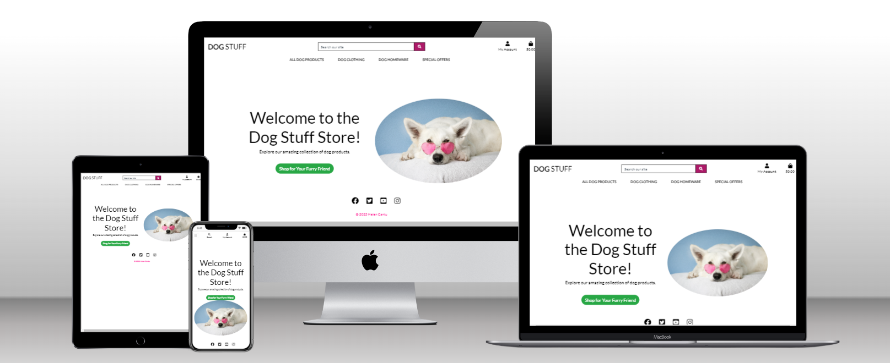
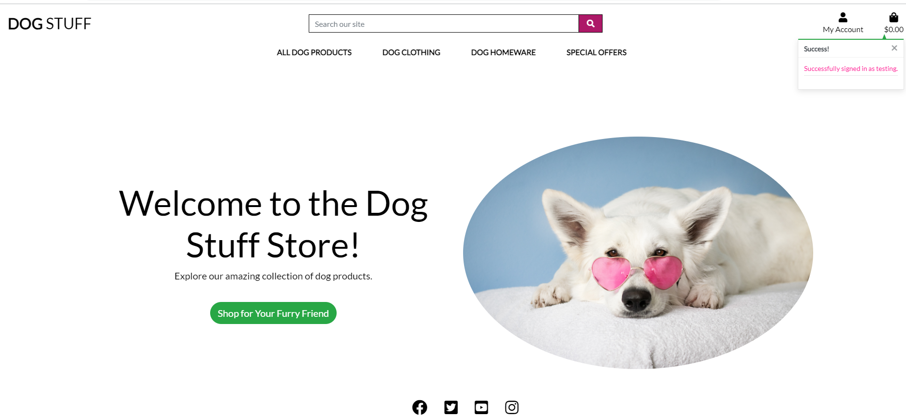
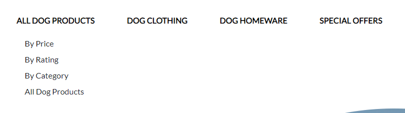
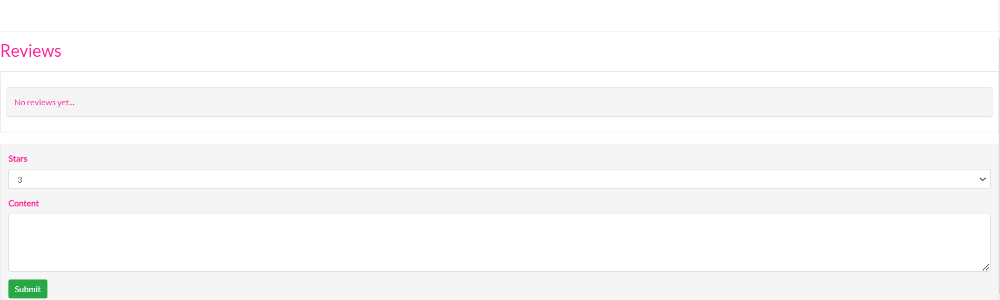
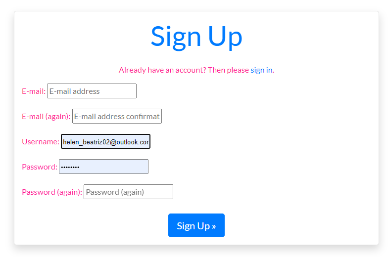
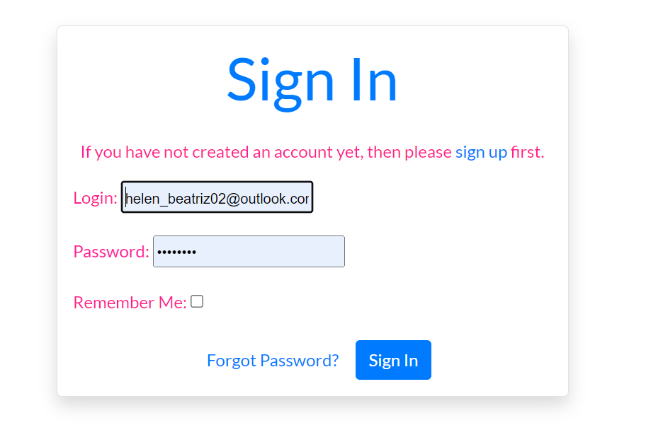
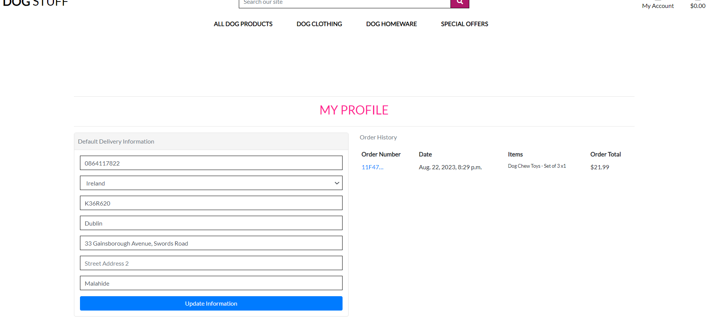
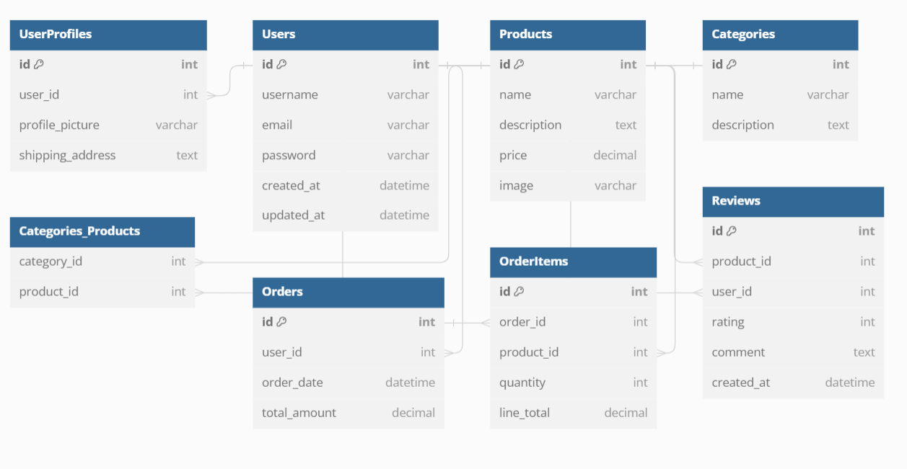

# Dog E-Commerce Shop

DoggStuff is a B2C (Business to Consumer) ecommerce platform that brings the world of high-quality dog products directly to dog owners and enthusiasts. We are dedicated to providing a seamless online shopping experience, where our business sells a wide range of dog-related products directly to our valued customers. Whether you're looking for stylish dog coats, cozy hoodies, fashionable dog t-shirts, or adorable dog bandanas, DoggStuff is your one-stop destination for all things doggy. Explore our curated selection, make secure purchases, and pamper your furry friends with the finest products. We're here to make tails wag and pups happy!"

[Visit live website](https://ecommercedogstore-167498ed6129.herokuapp.com/)

 


## Table of Contents
- [Introduction](#introduction)
- [Features](#features)
- [Installation](#installation)
- [Usage](#usage)
- [Testing](#prerequisites)
- [Credits](#credits)
- [License](#license)
- [Schema](#schema)

# Ecommerce Dog Stuff App Testing Guide

## Introduction

### What is the Dog E-Commerce Shop?

The Dog E-Commerce Shop is a comprehensive online platform designed to cater to dog lovers and pet owners. Our mission is to provide a seamless shopping experience, valuable resources, and a vibrant community for all things dog-related.

## Dog Shop Website User Stories


### Visitor (Non-Authenticated User):

- [ ] **View Home Page**: As a visitor, I want to view the home page to understand what the website offers.
 

- [ ] **Browse Categories**: I want to browse product categories and see a list of available products.
 

- [ ] **View Product Details**: I want to click on a product to view its details, including its name, description, price, and customer reviews.

 

- [ ] **Create Account**: I want to create an account on the website to access additional features.
 
 

- [ ] **Log In**: I want to log in to my account using my email and password.

 

### Authenticated User (Customer):

- [ ] **Add to Cart**: I want to add products to my shopping cart.

- [ ] **Modify Cart**: I want to view my shopping cart and modify the quantity or remove items.

- [ ] **Checkout**: I want to proceed to checkout to purchase the items in my cart.

- [ ] **Order History**: I want to view my order history to track past purchases.

 

- [ ] **Leave Reviews**: I want to leave reviews and comments on products.

 

- [ ] **Log Out**: I want to log out of my account when I'm done using the website.

### Admin User:

- [ ] **Add Products**: I want to add new products to the store, including their name, description, price, and category.

- [ ] **Edit Products**: I want to edit product details such as their name, description, price, and category.

- [ ] **Remove Products**: I want to remove products from the store.

- [ ] **View Orders**: I want to view a list of customer orders.

- [ ] **Manage Accounts**: I want to manage customer accounts (e.g., reset passwords, deactivate accounts).

### Customer (During Checkout):

- [ ] **Provide Shipping Info**: I want to provide shipping information, including my name, address, and contact details.

- [ ] **Select Payment Method**: I want to select a payment method and enter payment information securely.

- [ ] **Order Confirmation**: I want to receive an order confirmation email after completing a purchase.

### Authenticated User (Customer or Admin):

- [ ] **Search for Products**: I want to search for products using keywords.

- [ ] **Filter Products**: I want to filter products by category or price range.

- [ ] **View Product List**: I want to view a list of all products in the store.

- [ ] **Stock Status**: I want to see which products are out of stock.

## Features

### Explore Our Features

#### 1. Extensive Dog Product Catalog
- Browse through a vast catalog of dog products, including food, toys, accessories, and more.
- Search for products using keywords to find exactly what you need.
- Explore products by categories such as nutrition, health, grooming, and entertainment.
- Sort product listings by popularity, or user ratings for informed choices.


#### 2. Error Handling and Favicon
- Identify our website easily with our site-wide favicon displayed in your browser tab.
- In case of errors, we've implemented informative error pages for 404 (page not found), 403 (forbidden access), and 500 (internal server error) scenarios.

# Dog Store E-Commerce

## Features

### User Management

- **Login:** Returning users can log in to their accounts.
  - Users must have an account and provide a valid username and password.
  - Social sign-on with Google and Facebook is supported.

### Dashboard

- **User Dashboard:** After login, users are directed to their dashboard.
- **Admin Privileges:** Admins can access additional features:
  - **Add Products:** Admins can add new dog products for sale.
  - **Edit or Delete Products:** Admins can manage product listings.

### Product Display

- **Product Listings:** Display featured dog products with images, descriptions, and prices.

### Admin Features (Admins Only)

- **Add Products:** Admins can add new dog products for sale.
  - Include fields for product name, description, price, available quantity, and an image.
  - Categorize products into types (e.g., toys, food, accessories).
  - Users receive feedback upon successful product addition.

- **Edit and Delete Products:** Admins can manage product listings.
  - Options to edit or delete products.
  - Confirmation prompt before deleting a product.

### User Restrictions

- **Edit/Delete Categories:** Regular users and unauthenticated visitors cannot edit or delete categories.
- **Admin-Only Access:** Only logged-in admin users can access admin features.

## Usage

- Clone the repository.
- Set up the necessary environment and database configurations.
- Run the application to start your dog store e-commerce platform.

## License

This project is licensed under the [MIT License](LICENSE).

## Schema 
 
## Dog Shop Database Schema

### Products
- `product_id` 
- `product_name`
- `category`
- `description`
- `price`

### Customers
- `customer_id`
- `first_name`
- `last_name`
- `email`
- `phone_number`
- `address`

### Orders
- `order_id` 
- `customer_id` 
- `order_date`
- `total_amount`

### OrderItems
- `order_item_id` 
- `order_id`
- `product_id`
- `quantity_ordered`
- `item_price`

### Reviews
- `review_id` 
- `product_id` 
- `customer_id` 
- `rating`
- `comment`

### ShippingInfo
- `shipping_id`
- `order_id` 
- `shipment_date`
- `tracking_number`
- `delivery_address`


### Categories
- `category_id` 
- `category_name`

This database schema represents the core entities and relationships for a dog shop, allowing you to manage information about dogs, customers, orders, reviews.


### Logout
- Confirmation screen for logged-in users to log out from their account.
- There are two views depending on whether a user is logged in or not.
#### 5. Footer 
- Our comprehensive footer includes links to our social media profiles, making it easy to connect.

## User Stories

### Base Setup (As a Developer)
- As a developer, I need to create a foundational HTML structure for the website.
- As a developer, I need to implement a responsive CSS layout for various screen sizes.
- As a developer, I need to add JavaScript functionality to enhance user interactions.
- As a developer, I need to set up the backend using Node.js, Express, Django, and Python.
- As a developer, I need to integrate Bootstrap for a polished user interface.

### Product Catalog (As a User)
- As a user, I want to explore a comprehensive catalog of dog products.
- As a user, I want to easily search for products using keywords.
- As a user, I want to browse products by categories such as dog food, toys, and accessories.
- As a user, I want to sort product listings by popularity, date, or rating.

### Error Handling and Favicon (As a User)
- As a user, I want to easily identify the website by the favicon in the browser tab.
- As a user, I want to be directed to informative error pages in case of 404, 403, or 500 errors.

### Footer (As a User)
- As a user, I want to find links to the website's social media profiles in the footer.
- As a user, I want to have contact information available in the footer for inquiries.

### Product Management (As a Registered User)
- As a registered user, I want the ability to manage my product listings efficiently.
- As a user, I want to edit product information seamlessly with pre-filled fields and image uploads.

## Deployment

### Heroku Deployment
The site was deployed to Heroku. The steps to deploy are as follows:
- Navigate to heroku and create an account- Click the new button in the top right corner
- Select create new app
- Enter app name
- Select region and click create app
- Click the resources tab and search for Heroku Postgres
- Select hobby dev and continue
- Go to the settings tab and then click reveal config vars
- Add the following config vars: 
- SECRET_KEY: (Your secret key) 
- DATABASE_URL: (This should already exist with add on of postgres) 
- EMAIL_HOST_USER: (e-mail address) 
- EMAIL_HOST_PASS: (e-mail app password) 
- CLOUNDINARY_URL: (cloudinary api url)- Click the deploy tab
- Scroll down to Connect to GitHub and sign in / authorize when prompted
- In the search box, find the repositoy you want to deploy and click connect
- Scroll down to Manual deploy and choose the main branch- Click deploy
The app should now be deployed.

# Ecommerce Dog Stuff App Testing Guide

This document provides a step-by-step guide for testing the Dog Stuff ecommerce app. Testing is essential to ensure the app functions correctly and delivers a seamless shopping experience for users.

## Table of Contents

1. [Prerequisites](#prerequisites)
2. [Types of Testing](#types-of-testing)
    - [Unit Testing](#unit-testing)
    - [Integration Testing](#integration-testing)
    - [User Acceptance Testing](#user-acceptance-testing)
3. [Test Scenarios](#test-scenarios)
    - [User Registration](#user-registration)
    - [Product Browsing](#product-browsing)
    - [Shopping Cart](#shopping-cart)
    - [Checkout Process](#checkout-process)
4. [Testing Tools](#testing-tools)
5. [Running Tests](#running-tests)
6. [Reporting and Documentation](#reporting-and-documentation)
7. [Bug Tracking](#bug-tracking)
8. [Conclusion](#conclusion)

## Prerequisites

Before starting testing, ensure that you have the following:

- A local development environment with the app running.
- Test data (e.g., sample products, user accounts) for realistic testing.
- Testing tools and libraries installed (if applicable).

## Types of Testing

### Unit Testing

Unit testing focuses on testing individual components or functions of the application. Write unit tests to validate the correctness of small, isolated parts of the code, such as functions, methods, or classes.

### Integration Testing

Integration testing checks the interactions between different components or modules of the application. It ensures that various parts of the app work together as expected.

### User Acceptance Testing

User acceptance testing involves testing the application from the end user's perspective. It verifies that the app meets user requirements and functions as intended in a real-world scenario.

## Test Scenarios

### User Registration

1. Verify that a new user can successfully register an account.
    - Test that registration form validation works for email, password, and other required fields.
2. Ensure that user registration validation works for email, password, and other required fields.
3. Test the "Forgot Password" functionality to reset a user's password.

### Product Browsing

1. Test the ability to browse products by categories (e.g., dog coats, hoodies).
2. Verify that product details pages display accurate information (e.g., price, description, images).
3. Check that products can be filtered and sorted by various criteria.

### Shopping Cart

1. Add products to the shopping cart and verify the cart's contents.
2. Test cart updates (e.g., changing quantities, removing items).
3. Ensure that discounts or promo codes are applied correctly.
4. Check that the cart's total price is calculated accurately.

### Checkout Process

1. Test the checkout process, including entering shipping and payment information.
2. Verify that orders are successfully placed.
3. Check for email notifications (order confirmation, shipping updates).
4. Test error handling during checkout (e.g., declined payment).

## Testing Tools

We use the following testing tools:

- **Django Testing Framework**: Django's built-in testing framework for unit and integration testing.
- **Selenium**: For automated browser testing.
- **Postman**: For API testing.

## Running Tests

To run tests locally, use the following commands:

```bash
 Run unit tests
python manage.py test

Run Selenium browser tests
Add specific instructions for running Selenium tests here.

 Forking the GitHub Repository
1. Go to the GitHub repository
2. Click on Fork button in top right corner
3. You will then have a copy of the repository in your own GitHub account.
   
 Making a Local Clone
1. Go to the GitHub repository 
2. Locate the Code button above the list of files and click it
3. Highlight the "HTTPS" button to clone with HTTPS and copy the link
4. Open commandline interface on your computer
5. Change the current working directory to the one where you want the cloned directory
6. Type git clone and paste the URL from the clipboard 
  ```
  $ git clone <website link > 
  ```
7. Press Enter to create your local clone

### Languages & Frameworks

- HTML
- CSS
- Javascript
- Python 3.8.11
- Django 3.2.16


**External Python Modules**

- asgiref==3.6.0
- cloudinary==1.32.0
- dj-database-url==1.2.0
- dj3-cloudinary-storage==0.0.6
- Django==3.2.18
- django-allauth==0.52.0
- django-cloudinary-storage==0.3.0
- django-crispy-forms==1.14.0
- django-resized==1.0.2
- django-richtextfield==1.6.1
- django-summernote==0.8.20.0
- gunicorn==20.1.0
- migrate==0.3.8
- numpy==1.24.2
- oauthlib==3.2.2
- Pillow==9.4.0
- psycopg2==2.9.5
- PyJWT==2.6.0
- python3-openid==3.2.0
- pytz==2022.7.1
- requests-oauthlib==1.3.1
- sqlparse==0.4.3

### Libraries & Tools

- [Am I Responsive](http://ami.responsivedesign.is/) was used to create the multi-device mock-up at the top of this README.md file
- [Balsamiq](https://balsamiq.com/) to create the projects wireframes
- [Bootstrap v5.2.3](https://getbootstrap.com/). This project uses the Bootstrap library for UI components (Buttons, Card, Footer, Modal, Pagination, Navbar)
- [Cloudinary](https://cloudinary.com/) to store static files
- [Dbdiagram.io](https://dbdiagram.io/home) used for the database schema diagram
- [Favicon.io](https://favicon.io) for making the site favicon
- [Chrome dev tools](https://developers.google.com/web/tools/chrome-devtools/) was used for debugging of the code and checking site for responsiveness
- [Font Awesome](https://fontawesome.com/) - Icons from Font Awesome were used throughout the site
- [Git](https://git-scm.com/) was used for version control within VSCode to push the code to GitHub
- [GitHub](https://github.com/) was used as a remote repository to store project code
- [Google Fonts](https://fonts.google.com/)
- [Heroku](https://heroku.com) was used to deploy the project into live environment
- [jQuery](https://jquery.com) was used for drop-down exercises filters on smaller screens
- [Elephant SQL](https://www.elephantsql.com/) – deployed project on Heroku uses an Elephant SQL database
- [Summernote](https://summernote.org/) - editor used for exercise description field in Admin page
- [Visual Studio Code (VSCode)](https://code.visualstudio.com/) - code editor used to write this project
- Validation:
- [WC3 Validator](https://validator.w3.org/) was used to validate the html in the project
- [Jigsaw W3 Validator](https://jigsaw.w3.org/css-validator/) to validate the css in the project
- [JShint](https://jshint.com/) for JavaScript quality
- [Lighthouse](https://developers.google.com/web/tools/lighthouse/) for performance, accessibility, progressive web apps, SEO analysis of the project code
- [Wave Validator](https://wave.webaim.org/) to evaluate accessibility


## Credits

### Images

**Images used in this app were found on Pexels and other websites. I'm not able to list all but I'm not the author of any of the pics.**

### Code
I developed my website based on plenty of tutorials and also on the e-commerce included in the course. 
- Youtube Tutorial [tutorial] (https://www.youtube.com/playlist?list=PLXuTq6OsqZjbCSfiLNb2f1FOs8viArjWy)
- Django all-auth [documentation](https://django-allauth.readthedocs.io/en/latest/index.html)

### Acknowledgements
I want to express my gratitude towards all those who helped me in the creation of this project. Specifically, I would like to thank tutors available, especially my mentor Daisy and the support of my friends. 
